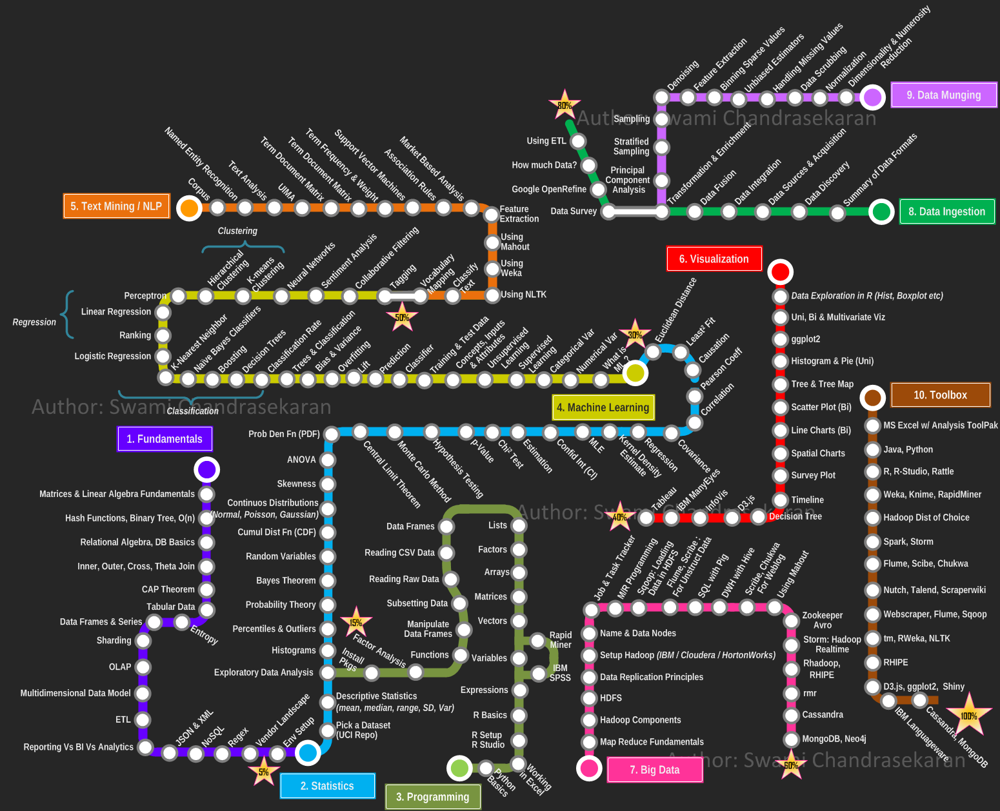

Predicting the Difficulty of Data Scientist Roles in Singapore Using Logistic Regression
============================================================================
**Team TRUMP | Gaelan Gu, Sunil Prakash, Rose Wang Ruoshi, Yolanda Yu Yue**

1. Objective
------------

We aim to develop a logistic regression model based on the technical skills required to
predict the level of difficulty of the job. The job of a Data Scientist is itself
challenging as it requires a large technical skill set. However, we will need to form some assumptions before beginning our analysis: 

* Level of difficulty (referred to as the *challenging_job* dependent variable) is determined based on whether the role requires a candidate to be innovative in thinking and is a great team player and communicator. Intangible qualities are selected instead of technical skills to avoid the problem of perfect correlation between *challenging_job* and the other variables.
* *challenging_job* dependent variable is assumed to be binary - 1 for challenging and 0 for not challenging (or "easy" to "average" level of difficulty in layman terms).
* Only meaningful and statistically significant variables are included in the final model and steps to achieve this is discussed in Section 3.2 of the report.

Thus this work is dedicated to build a model to predict the most relevant job, based on key technical skills.

 image credit: Swami
Chandrasekaran

2. Singapore Job Market Analysis
-----------------

In Singapore, the data scientist jobs are not too much dynamic, but
surely requires some key skills to have. To get the relevant job
information, we tried to do web scraping on <http://indeed.com.sg>
website to find out the details on the skill set required for data
scientist job.

Following is an overview, 

Now let us discuss about the implementation.

3. Implementation
-----------------

### 3.1 Web Scraping - Gathering the relevant data

The *rvest* R package helps to scrape information from web pages.
It is designed to work with *magrittr* to make it easy to express common
web scraping tasks, inspired by libraries like *beautiful soup* on Python.

    library(rvest)

    ## Loading required package: xml2

Firstly, we launch a query to read the job portal page.

    html_page <- read_html("https://www.indeed.com.sg/jobs?q=data+scientist&l=")
    print("html loaded")

    ## [1] "html loaded"

Next, we determine the number of search results for data scientist roles.

    #total results

    total_jobs <- html_page %>%
      html_node('#searchCount') %>%
      html_text()
    total_jobs <- as.integer(unlist(strsplit(total_jobs," "))[6])
    sprintf("total job are is %d" , total_jobs )

    ## [1] "total job are is 387"

As the job portal is paginated, we will need to navigate to each page to get all the relevant jobs for data scientist. *pages* ,
*companies* and *summaries* being extracted by navigating job portal's paginated set.

    rev_concat <- function(x,y){
      return(paste(y,x,sep = ""))
    }

    no_of_pages = ceiling( total_jobs / 10 )
    pages <- list()
    companies <- list()
    summaries <- list()
    for( i in 1:no_of_pages){
      page_wise = read_html(paste("https://www.indeed.com.sg/jobs?q=data+scientist&start=",(10 * i-1)+1))
      company_name = page_wise %>%
          html_nodes('.result[itemtype="http://schema.org/JobPosting"] ') %>%
            html_node('.company') %>%
              html_text()
      companies <- c(companies, gsub("\n|[ \t]+", " ", company_name) )
      
      short_desc = page_wise %>%
          html_nodes('.result[itemtype="http://schema.org/JobPosting"] ') %>%
            html_node('.summary') %>%
              html_text()
      summaries <- c(summaries, gsub("\n|[ \t]+", " ", short_desc) )
      
      
      job.result <- page_wise %>%
          html_nodes('.result[itemtype="http://schema.org/JobPosting"] ') %>%
            html_attr(name="data-jk") %>%
              rev_concat("https://www.indeed.com.sg/rc/clk?jk=")
      pages <- c(pages,job.result)
    }    

    summaries[0]

    ## list()

After navigating to each link provided in the job portal page, we open
the respective job description page to capture the entire job
description.

    # Submit form and get new url
    job_lists <- lapply(pages, function(item){
      description <- read_html(item) %>%
          html_text()
      return (tolower(gsub("[^A-Za-z\\-]|\\.+", " ",description)))
    })

    print("fetched all pages")

    ## [1] "fetched all pages"

We then convert the list of records to R data frames for further analysis.

    df <- data.frame(unlist(companies),unlist(summaries))
    names(df) <- c('company','requirement')
    head(df)

    ##                     company
    ## 1              Rolls-Royce 
    ## 2                      <NA>
    ## 3                     Dell 
    ## 4     Quinnox Solutions SG 
    ## 5        Quinnox Solutions 
    ## 6               Skyscanner 
    ##                                                                                                                                                          requirement
    ## 1     Experienced in exploring and visualising data, being able to work with large data sets. Experienced in the use of one or more current analytical / big data...
    ## 2  Experience handling large scale data and/or big data platform. Conduct ad-hoc data analysis; Deep understanding of and experience with machine learning models...
    ## 3                                     Prior relevant experience in data management, automation, IT programming, forecasting, data mining or statistical modeling....
    ## 4                 2+ experience as data scientist working on various data science projects. Familiar with big data technologies like Hadoop, Hive, Pig and Spark....
    ## 5                 2+ experience as data scientist working on various data science projects. Familiar with big data technologies like Hadoop, Hive, Pig and Spark....
    ## 6      A real passion for Data Analysis, Big Data & Software Engineering. As a Data Scientist at Skyscanner you can expect a wide variety of challenging Big Data...

    is_skill_present <- function(skill, job_desc){
      return(if(grepl(skill, job_desc)==TRUE) 1 else 0)
    }

    add_skill_info <- function(skillName){
      #return(as.factor(unlist(lapply(job_lists, function(job_desc) is_skill_present(skillName,job_desc)))))
      return(unlist(lapply(job_lists, function(job_desc) is_skill_present(skillName,job_desc))))
    }

Now adding a few technology skills, as column to dataset.

    df$have_python  <- add_skill_info('python')
    df$have_r       <- add_skill_info(' r')
    df$have_matlab  <- add_skill_info('matlab')
    df$have_java        <- add_skill_info(' java')
    df$have_scala        <- add_skill_info('scala')

    df$have_sas <- add_skill_info(' sas')
    df$have_spss <- add_skill_info('spss')
    df$have_hadoop <- add_skill_info('hadoop')
    df$have_jmp <- add_skill_info('jmp')
    df$have_tableau <- add_skill_info('tableau')
    df$have_sql <- add_skill_info(' sql')
    df$have_spark <- add_skill_info('spark')
    df$have_excel <- add_skill_info('excel')
    df$have_d3 <- add_skill_info('d3.js')

    df$have_ml <- add_skill_info('machine learning')
    df$have_bigdata <- add_skill_info('big data')
    df$have_cs <- add_skill_info('computer science')
    df$have_economics <- add_skill_info('economics')
    df$have_supplychain <- add_skill_info('supply chain')
    df$have_crm <- add_skill_info('crm')

    df$innovative <- add_skill_info('innovative')
    df$teamplayer  <- add_skill_info('team player')
    df$communicator  <- add_skill_info('communicator')
    #to find challenging job
    df$challenging_job <- as.factor((df$innovative=='1' & (df$teamplayer | df$communicator=='1'))) 

    df <- df[-23]
    df <- df[-23]
    df <- df[-23]

    head(df[3:23])

    ##   have_python have_r have_matlab have_java have_scala have_sas have_spss
    ## 1           1      1           1         0          0        1         1
    ## 2           0      1           0         0          0        0         0
    ## 3           0      1           0         0          0        1         1
    ## 4           1      1           0         0          0        0         0
    ## 5           1      1           0         0          0        0         0
    ## 6           1      1           0         1          1        0         0
    ##   have_hadoop have_jmp have_tableau have_sql have_spark have_excel have_d3
    ## 1           1        1            1        1          1          1       0
    ## 2           0        0            0        0          0          0       0
    ## 3           1        0            0        1          0          1       0
    ## 4           1        0            0        0          1          0       0
    ## 5           1        0            0        0          1          0       0
    ## 6           1        0            1        1          1          1       0
    ##   have_ml have_bigdata have_cs have_economics have_supplychain have_crm
    ## 1       1            1       0              0                0        0
    ## 2       0            0       0              0                0        0
    ## 3       0            0       1              1                1        0
    ## 4       1            1       1              0                0        0
    ## 5       1            1       1              0                0        0
    ## 6       1            1       1              0                0        0
    ##   challenging_job
    ## 1           FALSE
    ## 2           FALSE
    ## 3           FALSE
    ## 4           FALSE
    ## 5           FALSE
    ## 6            TRUE

Finally, we save the extracted dataset to CSV format for further analysis using different
tools.

    write.csv(df,file = "job_skills.csv")

### 3.2 Logistic Regression with r

#### 3.2.1 Importing Data

    jobs = read.csv('job_skills_v2.csv')

    # Removing single-factor variables and descriptive text columns
    jobs = jobs[, c(-1, -2, -4, -16, -22)]

#### 3.2.2 Testing for perfectly multicollinear variables and removing them
Perfectly multicollinear variables are undesirable in the model and will produce inaccurate results when it is run. Hence we have to test for the presence of such by running a correlation test among all variables to be considered.

    cor(jobs, method = 'pearson')

    ##                  have_python have_matlab  have_java have_scala    have_sas
    ## have_python       1.00000000   0.2182179  0.3273268  0.3273268 -0.04761905
    ## have_matlab       0.21821789   1.0000000 -0.1666667 -0.1666667  0.50917508
    ## have_java         0.32732684  -0.1666667  1.0000000  0.3750000  0.21821789
    ## have_scala        0.32732684  -0.1666667  0.3750000  1.0000000 -0.32732684
    ## have_sas         -0.04761905   0.5091751  0.2182179 -0.3273268  1.00000000
    ## have_spss        -0.21821789   0.6666667 -0.2500000 -0.2500000  0.76376262
    ## have_hadoop       0.52380952   0.2182179 -0.2182179  0.3273268 -0.04761905
    ## have_jmp          0.21821789   1.0000000 -0.1666667 -0.1666667  0.50917508
    ## have_tableau      0.32732684   0.6666667  0.3750000  0.3750000  0.21821789
    ## have_sql          0.08908708   0.4082483  0.6123724  0.1020621  0.80178373
    ## have_spark        0.80178373   0.2721655 -0.1020621  0.4082483 -0.35634832
    ## have_excel        0.08908708   0.4082483  0.1020621  0.1020621  0.35634832
    ## have_ml           0.80178373   0.2721655 -0.1020621  0.4082483 -0.35634832
    ## have_bigdata      0.65465367   0.3333333  0.0000000  0.0000000 -0.21821789
    ## have_cs           0.08908708  -0.2721655  0.1020621  0.1020621 -0.08908708
    ## have_economics   -0.50917508  -0.1111111 -0.1666667 -0.1666667  0.50917508
    ## have_supplychain -0.50917508  -0.1111111 -0.1666667 -0.1666667  0.50917508
    ## challenging_job   0.32732684  -0.1666667  0.3750000  0.3750000 -0.32732684
    ##                   have_spss have_hadoop   have_jmp have_tableau
    ## have_python      -0.2182179  0.52380952  0.2182179    0.3273268
    ## have_matlab       0.6666667  0.21821789  1.0000000    0.6666667
    ## have_java        -0.2500000 -0.21821789 -0.1666667    0.3750000
    ## have_scala       -0.2500000  0.32732684 -0.1666667    0.3750000
    ## have_sas          0.7637626 -0.04761905  0.5091751    0.2182179
    ## have_spss         1.0000000  0.32732684  0.6666667    0.3750000
    ## have_hadoop       0.3273268  1.00000000  0.2182179    0.3273268
    ## have_jmp          0.6666667  0.21821789  1.0000000    0.6666667
    ## have_tableau      0.3750000  0.32732684  0.6666667    1.0000000
    ## have_sql          0.6123724  0.08908708  0.4082483    0.6123724
    ## have_spark       -0.1020621  0.80178373  0.2721655    0.4082483
    ## have_excel        0.6123724  0.53452248  0.4082483    0.6123724
    ## have_ml          -0.1020621  0.80178373  0.2721655    0.4082483
    ## have_bigdata      0.0000000  0.65465367  0.3333333    0.5000000
    ## have_cs           0.1020621  0.53452248 -0.2721655    0.1020621
    ## have_economics    0.6666667  0.21821789 -0.1111111   -0.1666667
    ## have_supplychain  0.6666667  0.21821789 -0.1111111   -0.1666667
    ## challenging_job  -0.2500000  0.32732684 -0.1666667    0.3750000
    ##                     have_sql have_spark have_excel    have_ml have_bigdata
    ## have_python       0.08908708  0.8017837 0.08908708  0.8017837    0.6546537
    ## have_matlab       0.40824829  0.2721655 0.40824829  0.2721655    0.3333333
    ## have_java         0.61237244 -0.1020621 0.10206207 -0.1020621    0.0000000
    ## have_scala        0.10206207  0.4082483 0.10206207  0.4082483    0.0000000
    ## have_sas          0.80178373 -0.3563483 0.35634832 -0.3563483   -0.2182179
    ## have_spss         0.61237244 -0.1020621 0.61237244 -0.1020621    0.0000000
    ## have_hadoop       0.08908708  0.8017837 0.53452248  0.8017837    0.6546537
    ## have_jmp          0.40824829  0.2721655 0.40824829  0.2721655    0.3333333
    ## have_tableau      0.61237244  0.4082483 0.61237244  0.4082483    0.5000000
    ## have_sql          1.00000000 -0.1666667 0.58333333 -0.1666667    0.0000000
    ## have_spark       -0.16666667  1.0000000 0.25000000  1.0000000    0.8164966
    ## have_excel        0.58333333  0.2500000 1.00000000  0.2500000    0.4082483
    ## have_ml          -0.16666667  1.0000000 0.25000000  1.0000000    0.8164966
    ## have_bigdata      0.00000000  0.8164966 0.40824829  0.8164966    1.0000000
    ## have_cs           0.16666667  0.2500000 0.16666667  0.2500000    0.4082483
    ## have_economics    0.40824829 -0.4082483 0.40824829 -0.4082483   -0.3333333
    ## have_supplychain  0.40824829 -0.4082483 0.40824829 -0.4082483   -0.3333333
    ## challenging_job   0.10206207  0.4082483 0.61237244  0.4082483    0.5000000
    ##                      have_cs have_economics have_supplychain
    ## have_python       0.08908708     -0.5091751       -0.5091751
    ## have_matlab      -0.27216553     -0.1111111       -0.1111111
    ## have_java         0.10206207     -0.1666667       -0.1666667
    ## have_scala        0.10206207     -0.1666667       -0.1666667
    ## have_sas         -0.08908708      0.5091751        0.5091751
    ## have_spss         0.10206207      0.6666667        0.6666667
    ## have_hadoop       0.53452248      0.2182179        0.2182179
    ## have_jmp         -0.27216553     -0.1111111       -0.1111111
    ## have_tableau      0.10206207     -0.1666667       -0.1666667
    ## have_sql          0.16666667      0.4082483        0.4082483
    ## have_spark        0.25000000     -0.4082483       -0.4082483
    ## have_excel        0.16666667      0.4082483        0.4082483
    ## have_ml           0.25000000     -0.4082483       -0.4082483
    ## have_bigdata      0.40824829     -0.3333333       -0.3333333
    ## have_cs           1.00000000      0.4082483        0.4082483
    ## have_economics    0.40824829      1.0000000        1.0000000
    ## have_supplychain  0.40824829      1.0000000        1.0000000
    ## challenging_job   0.10206207     -0.1666667       -0.1666667
    ##                  challenging_job
    ## have_python            0.3273268
    ## have_matlab           -0.1666667
    ## have_java              0.3750000
    ## have_scala             0.3750000
    ## have_sas              -0.3273268
    ## have_spss             -0.2500000
    ## have_hadoop            0.3273268
    ## have_jmp              -0.1666667
    ## have_tableau           0.3750000
    ## have_sql               0.1020621
    ## have_spark             0.4082483
    ## have_excel             0.6123724
    ## have_ml                0.4082483
    ## have_bigdata           0.5000000
    ## have_cs                0.1020621
    ## have_economics        -0.1666667
    ## have_supplychain      -0.1666667
    ## challenging_job        1.0000000

We discover that there are perfectly correlated variables which we must remove from the dataset - mainly *have_jmp*, *have_ml*,  *have_supplychain*.

    # Removing have_jmp, have_ml, have_supplychain variables
    jobs = jobs[, c(-8, -13, -17)]

#### 3.2.3 Factorizing the variables

    # Factorizing the variables
    for (i in 1:15){
      jobs[, i] = as.factor(jobs[, i])
    }

    summary(jobs)

    ##  have_python have_matlab have_java have_scala have_sas have_spss
    ##  0:117       0:351       0:312     0:312      0:273    0:312    
    ##  1:273       1: 39       1: 78     1: 78      1:117    1: 78    
    ##  have_hadoop have_tableau have_sql have_spark have_excel have_bigdata
    ##  0:117       0:312        0:234    0:156      0:234      0:195       
    ##  1:273       1: 78        1:156    1:234      1:156      1:195       
    ##  have_cs have_economics challenging_job
    ##  0:234   0:351          0:312          
    ##  1:156   1: 39          1: 78

#### 3.2.4 Train-Test Split

    library(caTools)
    set.seed(123)
    split = sample.split(jobs$challenging_job, SplitRatio = .8)
    trainset = subset(jobs, split == TRUE)
    testset = subset(jobs, split == FALSE)

We have 390 observations in all, which we will perform an 80:20 train-test split. There will be 312 rows in the training dataset and 78 in the testing dataset.

#### 3.2.4 Logistic Regression
With *challenging_job* as the dependent variable, we will attempt to develop a logistic regression model against all of the other independent variables.

    jobsfit = glm(formula = challenging_job ~ ., 
                  family = binomial,
                  data = trainset)

    ## Warning: glm.fit: algorithm did not converge

    summary(jobsfit)

    ## 
    ## Call:
    ## glm(formula = challenging_job ~ ., family = binomial, data = trainset)
    ## 
    ## Deviance Residuals: 
    ##        Min          1Q      Median          3Q         Max  
    ## -2.409e-06  -2.409e-06  -2.409e-06  -2.409e-06   2.409e-06  
    ## 
    ## Coefficients: (7 not defined because of singularities)
    ##                   Estimate Std. Error z value Pr(>|z|)
    ## (Intercept)     -2.657e+01  4.452e+04  -0.001    1.000
    ## have_python1    -2.452e-13  6.372e+04   0.000    1.000
    ## have_matlab1     8.090e-14  1.101e+05   0.000    1.000
    ## have_java1      -4.618e-06  1.205e+05   0.000    1.000
    ## have_scala1     -2.754e-14  7.941e+04   0.000    1.000
    ## have_sas1        4.618e-06  1.572e+05   0.000    1.000
    ## have_spss1      -5.313e+01  2.330e+05   0.000    1.000
    ## have_hadoop1            NA         NA      NA       NA
    ## have_tableau1           NA         NA      NA       NA
    ## have_sql1               NA         NA      NA       NA
    ## have_spark1             NA         NA      NA       NA
    ## have_excel1      5.313e+01  8.033e+04   0.001    0.999
    ## have_bigdata1           NA         NA      NA       NA
    ## have_cs1                NA         NA      NA       NA
    ## have_economics1         NA         NA      NA       NA
    ## 
    ## (Dispersion parameter for binomial family taken to be 1)
    ## 
    ##     Null deviance: 3.1114e+02  on 311  degrees of freedom
    ## Residual deviance: 1.8101e-09  on 304  degrees of freedom
    ## AIC: 16
    ## 
    ## Number of Fisher Scoring iterations: 25

Logistic regression algorithm did not converge, so we have to select a smaller
number of independent variables for the model to work.

    jobsfit1 = glm(formula = challenging_job ~ have_java + have_tableau + have_scala, 
                  family = binomial,
                  data = trainset)
    summary(jobsfit1)

    ## 
    ## Call:
    ## glm(formula = challenging_job ~ have_java + have_tableau + have_scala, 
    ##     family = binomial, data = trainset)
    ## 
    ## Deviance Residuals: 
    ##     Min       1Q   Median       3Q      Max  
    ## -0.7402  -0.7133  -0.4058  -0.4058   2.2529  
    ## 
    ## Coefficients:
    ##               Estimate Std. Error z value Pr(>|z|)    
    ## (Intercept)    -2.4554     0.2292 -10.711  < 2e-16 ***
    ## have_java1      1.2166     0.3846   3.164 0.001558 ** 
    ## have_tableau1   1.2166     0.3846   3.164 0.001558 ** 
    ## have_scala1     1.3006     0.3862   3.368 0.000757 ***
    ## ---
    ## Signif. codes:  0 '***' 0.001 '**' 0.01 '*' 0.05 '.' 0.1 ' ' 1
    ## 
    ## (Dispersion parameter for binomial family taken to be 1)
    ## 
    ##     Null deviance: 311.14  on 311  degrees of freedom
    ## Residual deviance: 238.10  on 308  degrees of freedom
    ## AIC: 246.1
    ## 
    ## Number of Fisher Scoring iterations: 4

We managed to achieve a reasonable combination of significant independent variables (p-values for each variable are less than 0.05).
A high Akaike Information Criterion (AIC) of 246 would indicate a poor goodness of fit for the model, however the technical skills selected in the model appear to be highly relevant to the difficulty of the role.

Java is a general-purpose programming language which can be used to carry out a wide range of tasks, including data analytics. Tableau is a highly useful program used in many global organizations to create informative and insightful visualizations. Lastly, Scala is a programming language like Java but is frequently used in conjunction with very large databases.

#### 3.2.5 Chi-Square Test of Independence

    attach(jobsfit1)
    pchisq(null.deviance - deviance, df.null - df.residual, lower.tail = FALSE)

    ## [1] 9.526824e-16

    detach(jobsfit1)

Since p-value is less than 0.05, we reject the null hypothesis that there is
no relationship between the variables; *challenging_job* is dependent on the other variables.

#### 3.2.6 Validating the model

    prob_pred = predict(jobsfit1, newdata = testset[-15], type = 'response')
    challenge_pred = ifelse(prob_pred > 0.5, 1, 0)

#### 3.2.7 Confusion Matrix

    cm = table(testset[, 15], challenge_pred)
    cm

    ##    challenge_pred
    ##      0  1
    ##   0 62  0
    ##   1 10  6

The confusion matrix tells us that the model has a 87% accuracy rate; 68 correct predictions out of 78. This suggests that our model is sufficiently strong enough to predict the difficulty of a role based on the abovementioned 3 technical skills.

\*\* Thank you \*\*
