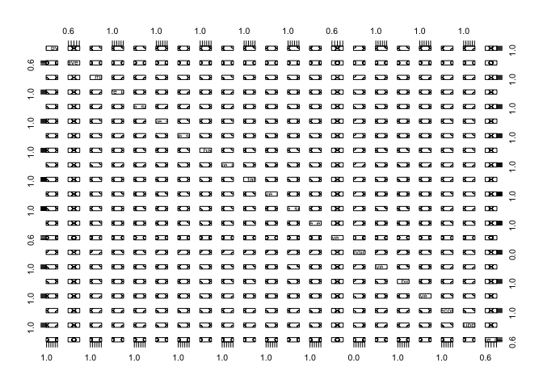

Logistic Regression on Data Science Skills
==========================================

    library(rvest)

    ## Loading required package: xml2

    query = "data scientist"
    loc = ""
    html_page <- read_html("https://www.indeed.com.sg/jobs?q=data+scientist&l=")
    html_page

    ## {xml_document}
    ## <html lang="en">
    ## [1] <head>\n<meta http-equiv="content-type" content="text/html;charset=U ...
    ## [2] <body data-tn-originlogtype="jobsearch" data-tn-originlogid="1b88jvo ...

    #total results

    total_jobs <- html_page %>%
      html_node('#searchCount') %>%
      html_text()
    total_jobs <- as.integer(unlist(strsplit(total_jobs," "))[6])
    sprintf("total job are is %d" , total_jobs )

    ## [1] "total job are is 381"

Now lets define functions

    rev_concat <- function(x,y){
      return(paste(y,x,sep = ""))
    }

    no_of_pages = ceiling( total_jobs / 10 )
    pages <- list()
    companies <- list()
    summaries <- list()
    for( i in 1:2){
      page_wise = read_html(paste("https://www.indeed.com.sg/jobs?q=data+scientist&start=",(10 * i-1)+1))
      company_name = page_wise %>%
          html_nodes('.result[itemtype="http://schema.org/JobPosting"] ') %>%
            html_node('.company') %>%
              html_text()
      companies <- c(companies, gsub("\n|[ \t]+", " ", company_name) )
      
      short_desc = page_wise %>%
          html_nodes('.result[itemtype="http://schema.org/JobPosting"] ') %>%
            html_node('.summary') %>%
              html_text()
      summaries <- c(summaries, gsub("\n|[ \t]+", " ", short_desc) )
      
      
      job.result <- page_wise %>%
          html_nodes('.result[itemtype="http://schema.org/JobPosting"] ') %>%
            html_attr(name="data-jk") %>%
              rev_concat("https://www.indeed.com.sg/rc/clk?jk=")
      pages <- c(pages,job.result)
    }    

    head(companies)

    ## [[1]]
    ## [1] "      Rolls-Royce "
    ## 
    ## [[2]]
    ## [1] NA
    ## 
    ## [[3]]
    ## [1] "      Dell "
    ## 
    ## [[4]]
    ## [1] "    Quinnox Solutions SG "
    ## 
    ## [[5]]
    ## [1] "    Quinnox Solutions "
    ## 
    ## [[6]]
    ## [1] "      Skyscanner "

    head(pages)

    ## [[1]]
    ## [1] "https://www.indeed.com.sg/rc/clk?jk=b175aee77c939dda"
    ## 
    ## [[2]]
    ## [1] "https://www.indeed.com.sg/rc/clk?jk=2e3f7aa594fea422"
    ## 
    ## [[3]]
    ## [1] "https://www.indeed.com.sg/rc/clk?jk=ca6f6588eec53b79"
    ## 
    ## [[4]]
    ## [1] "https://www.indeed.com.sg/rc/clk?jk=41eed63ed5a10df4"
    ## 
    ## [[5]]
    ## [1] "https://www.indeed.com.sg/rc/clk?jk=bf22e280ed52d792"
    ## 
    ## [[6]]
    ## [1] "https://www.indeed.com.sg/rc/clk?jk=2d218ffdceaa562e"

    head(summaries)

    ## [[1]]
    ## [1] " Experienced in exploring and visualising data, being able to work with large data sets. Experienced in the use of one or more current analytical / big data..."
    ## 
    ## [[2]]
    ## [1] " Experience handling large scale data and/or big data platform. Conduct ad-hoc data analysis; Deep understanding of and experience with machine learning models..."
    ## 
    ## [[3]]
    ## [1] " Prior relevant experience in data management, automation, IT programming, forecasting, data mining or statistical modeling...."
    ## 
    ## [[4]]
    ## [1] " 2+ experience as data scientist working on various data science projects. Familiar with big data technologies like Hadoop, Hive, Pig and Spark...."
    ## 
    ## [[5]]
    ## [1] " 2+ experience as data scientist working on various data science projects. Familiar with big data technologies like Hadoop, Hive, Pig and Spark...."
    ## 
    ## [[6]]
    ## [1] " A real passion for Data Analysis, Big Data & Software Engineering. As a Data Scientist at Skyscanner you can expect a wide variety of challenging Big Data..."

Lets get details for each one

    # Submit form and get new url
    job_lists <- lapply(pages, function(item){
      description <- read_html(item) %>%
          html_text()
      return (tolower(gsub("[^A-Za-z\\-]|\\.+", " ",description)))
    })

    job_lists[1]

    ## [[1]]
    ## [1] "rolls-roycego to the main content section  my account options sign inthis service is set to disconnect automatically after     minutes of inactivity  your session will end in     minutes click ok to reset the timer to     minutes you have been signed out this service is set to sign out after     minutes of inactivity job searchmy jobpagebasic search advanced search jobs matching my profile all jobsmy applications my saved jobs my saved searches beginning of the main content section return to the home pageprintable formatreturn to previous position on page   -description  qualifications and experience  job - primary location - other locations - schedule - job posting - closing date - contact name - external -  - refer a friend for this jobrefer a friendrefer a candidatesubmit a candidate s profile    var  ftl       acts    reqlistalljobspage   joblist     requisitiondescriptionpage   jobdetail     requisitiondescriptionviewpage   jobview     requisitiondescriptionprintablepage   jobprint     unavailablerequisitionprintablepage   jobprintunavailable     reqlistbasicpage   jobsearch     reqlistadvancedpage   moresearch     unavaiblerequisitionpage   unavailablerequisition     myjobcartpage   mycart     reqlistpersonalizedpage   myjobs     mysavedsearchespage   mysearches     applicationstatusdetailpage   applicationstatusdetail     applicationstatusdetailprintableformatpage   applicationstatusdetailprint     myreferralspage   myreferrals     mysubmissionspage   mysubmissions     withdrawapplicationconfirmationpage   withdrawapplicationconfirm     confirmcandidatepage   confirmcandidate     correspondencelistpage   emaillist     correspondencedetailpage   emaildetail     correspondenceprintableformatpage   emailprint     requesterrorpage   error     notavailablepage   notavailable     nojavascriptpage   nojavascript     unsupportedpage   unsupported     selectorpage   selector     ftlpspage   ftlps       ints   topnavinterface   requisitiondescriptioninterface   bottombarinterface     topnavinterface       ctls         hles    usernamelabel   id      id      jobcartaction   technicalhelpinfotop   id      id      id      id      id      id      id      id      id          pars         prps     id      id      title        id      id      alt        id      jobsearchtabaction   title        id      myjobpagetabactions   title        id      basicsearchtabaction   title        id      advancedsearchtabaction   title        id      jobsmatchingmyprofiletabaction   title        id      alljobstabaction   title        id      mysubmissionstabaction   title        id      myjobcarttabaction   title        id      mysavedsearchtabaction   title           mpts         hpts         lsts          requisitiondescriptioninterface       ctls         hles    id      pagerdivid    previous   id       pagerdivid    next   id       id       up email on req   id       id       requisitiondescriptiontitlelabel   requisitiondescriptiontitle   id       id       id       id       id       id       id       id       id       pagerdivid     previous   id       pagerdivid     next   id           pars    id          prps     id       pagerdivid    previous   title        id       pagerdivid    next   title        id       id       childnodes    title        id       id       childnodes    title        id       id       childnodes    title        id       id       style display   true  block   none      id       id       style display   true  block   none      id       id       childnodes    title        id       id       childnodes    title        id       id       childnodes    title        id       pagerdivid     previous   title        id       pagerdivid     next   title        id       id       style display   true  inline   none      id       id       style display   true  inline   none      id       id       style display   true  inline   none      id       id       style display   true  inline   none      id       id       style display   true  inline   none      id       id       style display     none   inline      id       id       style display     none   inline      id       id       style display     none   inline      id       id       style display     none   inline      id       id       style display     none   inline      id       id       style display     none   inline      id       id       style display     none   inline      id       id       style display     none   inline      id       id       style display     none   inline      id       id       style display     none   inline      id       id       style display   true  block   none      id       id       style display   true  inline   none      id       id       style display   true  inline   none      id       id       style display   true  inline   none      id       id       style display   true  inline   none      id       id       style display   true  inline   none         mpts         hpts         lsts    descrequisition      descrequisition        size         hles    id       id       id       id       id       id       id       id       id       id       id       id       reqtitlelinkaction   reqcontestnumbervalue   id       id       id       id       id       id       id       id       id       id       id       id       id       reqpostingdate   id       requnpostingdate   id       id       id       id       id       id       id       id       id       id       id       id       id       id       id       id       id       id            hlid    reqlistitem no   reqlistitem applyonlinejobdesc   reqlistitem no   reqlistitem referjobdesc   reqlistitem applyemailsubjectapplication   reqlistitem applyemailjobdesc   reqlistitem no   reqlistitem addedtojobcart   reqlistitem displayjobcartactionjobdesc   reqlistitem shareurl   reqlistitem title   reqlistitem shareable   reqlistitem title   reqlistitem contestnumber   reqlistitem description   reqlistitem description   reqlistitem qualification   reqlistitem qualification   reqlistitem jobfield   reqlistitem jobfield   reqlistitem primarylocation   reqlistitem primarylocation   reqlistitem otherlocations   reqlistitem otherlocations   reqlistitem jobschedule   reqlistitem jobschedule   reqlistitem postingdate   reqlistitem postingdate   reqlistitem closedate   reqlistitem unpostingdate   reqlistitem contactname   reqlistitem contactname   reqlistitem g               reqlistitem g               reqlistitem displayreferfriendaction   reqlistitem no   reqlistitem no   reqlistitem applyonlinejobdesc   reqlistitem no   reqlistitem referjobdesc   reqlistitem applyemailsubjectapplication   reqlistitem applyemailjobdesc   reqlistitem no   reqlistitem addedtojobcart   reqlistitem displayjobcartactionjobdesc   reqlistitem shareurl   reqlistitem title   reqlistitem shareable        pars    id       id       id       id       id       id       id       id       id       id       id       id       id       id       id            prps     id       id       style display   true  inline   none      id       id       style display   true  inline   none      id       id       style display   true  inline   none      id       id       style display   true  inline   none      id       id       style display   true  inline   none      id       id       style display     none   inline      id       id       style display     none   inline      id       id       style display     none   inline      id       id       style display     none   inline      id       id       style display     none   inline      id       id       style display     none   inline      id       id       style display     none   inline      id       id       style display     none   inline      id       id       style display     none   inline      id       id       style display     none   inline      id       id       style display   true  block   none      id       id       style display   true  inline   none      id       id       style display   true  inline   none      id       id       style display   true  inline   none      id       id       style display   true  inline   none      id       id       style display   true  inline   none          grps          mpts    id       id       id       id       id       id       id       id       id            hpts    id       id       id       id       id       id       id       id       id       id       id                bottombarinterface       ctls         hles    technicalhelpinfobottom       pars         prps         mpts         hpts         lsts          setup  function       var api    ftl api    api fillform  topnavinterface          ftltab inittabbar  topnavinterface   topnavinterface tablevel          ftltab inittabbar  topnavinterface   topnavinterface tablevel a   topnavinterface tabjs      ftltab inittabbar  topnavinterface   topnavinterface tablevel b   topnavinterface tabmy      api fillinterface  topnavinterface     welcome  you are not signed in    my saved jobs   my saved jobs   my saved jobs        cp style    margin-top   px  margin-bottom   px      e   nbsp   c p  e  a  cp style    margin-top   px  margin-bottom   px      e  ca href    http   www rolls-royce com careers contact index jsp    rel    external     etechnical help  c a  e  c p  e   go to the section job search   go to the section my jobpage   open the page basic search   open the page advanced search   open the page jobs matching my profile   open the page all jobs   open the page my applications   open the page my saved jobs   open the page my saved searches       api fillform  requisitiondescriptioninterface          api fillinterface  requisitiondescriptioninterface        previous   go to the previous job   next   go to the next job   apply for this position online   apply by email   apply to this position by email   add this position to my saved jobs   job description - decision scientist  jr           job description   contact phone number   tell us about a friend who might be interested in this job  all privacy rights will be protected    false   tell us about a person who might be interested in working for our organisation  all privacy rights will be protected    true        cimg alt        src    https   ad doubleclick net ddm activity src         type xpwtc  cat rolls  u   candidatenumber  u   requisitioncontestnumber  ord   num  randomnumber      width         height            e   apply for this position online   apply to this position by email   add this position to my saved jobs   previous   go to the previous job   next   go to the next job       api filllist  requisitiondescriptioninterface    descrequisition              true            false   submission for the position  decision scientist -  job number  jr           false            false   true   https   rolls-royce taleo net careersection jobdetail ftl job jr          lang en gb   decision scientist   true   decision scientist   jr               cp style    margin-bottom   px  margin-top   px     eas a decision scientist  you will develop the capability and application of business knowledge  mathematics  technology  design thinking and behavioural sciences to enable better decision support solutions within our data services and implement those decisions with the customer  this is your chance to flex your expertise in analysis  visualisation and algorithmic   mathematical computations and extract insights from data in response to these business problems  questioning and hypothesising using the data available from our customers  within rolls-royce and externally    c p  e  a  cp style    margin-bottom   px  margin-top   px     e  c p  e  a  cp style    margin-bottom   px  margin-top   px     e   nbsp   c p  e  a  cp style    margin-bottom   px  margin-top   px     e  c p  e  a  cp style    margin-bottom   px  margin-top   px     erolls-royce is one of the most technologically advanced organisations in the world - and our information systems are no exception  by improving information systems  applications and data  and technologies  we support overall business strategy and help teams throughout rolls-royce prepare for the future   c p  e  a  cp style    margin-bottom   px  margin-top   px     e  c p  e  a  cp style    margin-bottom   px  margin-top   px     e   nbsp   c p  e  a  cp style    margin-bottom   px  margin-top   px     e  c p  e  a  cp style    margin-bottom   px  margin-top   px     ekey accountabilities  c p  e  a  cp style    margin-bottom   px  margin-top   px     e  c p  e  a  cul  e  a  cli  e   nbsp validate output from data analytics and balance this with knowledge and understanding to provide decision support to customers   a  c li  e  cli  eassess and develop future capabilities and technologies relevant for big data and predictive analytics  you will be working with state of the art tools  assess future trends  and develop services as demonstrators and beta service offerings for use in the near future    a  c li  e  cli  eenable the on-going creation  translation and consumption of data-driven insights to help rolls-royce and our customers make better decisions - increasing the efficiency and effectiveness of the services that we and our customers deliver    a  c li  e  cli  eaddress business problems that are ill defined and shifting where factors affecting the problem are not completely understood    nbsp    a  c li  e  cli  econtribute to the development or implementation of applications that demonstrate and illustrate the impact of data science on customer operations    a  c li  e  cli  etrial new approaches  new techniques  new technologies  and assess the impact of the latest technology trends    a  c li  e  cli  ebe instrumental in setting up and defining the capabilities needed to utilise business knowledge  mathematics  technology  design thinking   c li  e  c ul  e        cp style    margin-bottom   px  margin-top   px     eas a decision scientist  you will develop the capability and application of business knowledge  mathematics  technology  design thinking and behavioural sciences to enable better decision support solutions within our data services and implement those decisions with the customer  this is your chance to flex your expertise in analysis  visualisation and algorithmic   mathematical computations and extract insights from data in response to these business problems  questioning and hypothesising using the data available from our customers  within rolls-royce and externally    c p  e  a  cp style    margin-bottom   px  margin-top   px     e  c p  e  a  cp style    margin-bottom   px  margin-top   px     e   nbsp   c p  e  a  cp style    margin-bottom   px  margin-top   px     e  c p  e  a  cp style    margin-bottom   px  margin-top   px     erolls-royce is one of the most technologically advanced organisations in the world - and our information systems are no exception  by improving information systems  applications and data  and technologies  we support overall business strategy and help teams throughout rolls-royce prepare for the future   c p  e  a  cp style    margin-bottom   px  margin-top   px     e  c p  e  a  cp style    margin-bottom   px  margin-top   px     e   nbsp   c p  e  a  cp style    margin-bottom   px  margin-top   px     e  c p  e  a  cp style    margin-bottom   px  margin-top   px     ekey accountabilities  c p  e  a  cp style    margin-bottom   px  margin-top   px     e  c p  e  a  cul  e  a  cli  e   nbsp validate output from data analytics and balance this with knowledge and understanding to provide decision support to customers   a  c li  e  cli  eassess and develop future capabilities and technologies relevant for big data and predictive analytics  you will be working with state of the art tools  assess future trends  and develop services as demonstrators and beta service offerings for use in the near future    a  c li  e  cli  eenable the on-going creation  translation and consumption of data-driven insights to help rolls-royce and our customers make better decisions - increasing the efficiency and effectiveness of the services that we and our customers deliver    a  c li  e  cli  eaddress business problems that are ill defined and shifting where factors affecting the problem are not completely understood    nbsp    a  c li  e  cli  econtribute to the development or implementation of applications that demonstrate and illustrate the impact of data science on customer operations    a  c li  e  cli  etrial new approaches  new techniques  new technologies  and assess the impact of the latest technology trends    a  c li  e  cli  ebe instrumental in setting up and defining the capabilities needed to utilise business knowledge  mathematics  technology  design thinking   c li  e  c ul  e        cul  e  a  cli  edegree level education in mathematics  scientific  computing or engineering discipline or equivalent experience    a  c li  e  cli  ean ability to apply logical  analytical and innovative thinking on a range of technical problems  with a particular bias towards the application of existing analytical methods  the development of new methods and software engineering    a  c li  e  cli  esome experience with predicative analytics  advanced analytics and machine learning algorithms is essential    a  c li  e  cli  edomain knowledge of one of the following  gas turbine engines  aircraft engineering  airline operations or aviation maintenance repair and overhaul is highly desirable   a  c li  e  cli  eability to interpret complex business requirements  translating them into analytical problems and delivering high value outputs    a  c li  e  cli  eexperienced in the use of one or more current analytical   big data technologies such as azure  machine learning  stream analytics  data factories etc   r  python  including relevant libraries   sas  matlab  spark  hive  hadoop  sql  tableau  power bi  spss  jmp etc    a  c li  e  cli  eexperienced in exploring and visualising data  being able to work with large data sets   c li  e  c ul  e  a  cp style    margin-bottom   px  margin-top   px     e  c p  e  a  cp style    margin-bottom   px  margin-top   px     eat rolls-royce  we focus on the future in every sense  we continually break new ground with integrated power solutions that are technologically advanced and create better power for a changing world   c p  e  a  cp style    margin-bottom   px  margin-top   px     e   nbsp   c p  e  a  cp style    margin-bottom   px  margin-top   px     ecreate momentum  join us and you   ll develop your skills and expertise to the very highest levels  working in an international environment for a company known the world over for excellence and innovation   c p  e  a  cp style    margin-bottom   px  margin-top   px     e   nbsp   c p  e  a  cp style    margin-bottom   px  margin-top   px     etrusted to deliver excellence   c p  e  a  cp style    margin-bottom   px  margin-top   px     e   nbsp   c p  e  a  cp style    margin-bottom   px  margin-top   px     ewe are an equal opportunities employer   c p  e  a  cp style    margin-bottom   px  margin-top   px     e  c p  e        cul  e  a  cli  edegree level education in mathematics  scientific  computing or engineering discipline or equivalent experience    a  c li  e  cli  ean ability to apply logical  analytical and innovative thinking on a range of technical problems  with a particular bias towards the application of existing analytical methods  the development of new methods and software engineering    a  c li  e  cli  esome experience with predicative analytics  advanced analytics and machine learning algorithms is essential    a  c li  e  cli  edomain knowledge of one of the following  gas turbine engines  aircraft engineering  airline operations or aviation maintenance repair and overhaul is highly desirable   a  c li  e  cli  eability to interpret complex business requirements  translating them into analytical problems and delivering high value outputs    a  c li  e  cli  eexperienced in the use of one or more current analytical   big data technologies such as azure  machine learning  stream analytics  data factories etc   r  python  including relevant libraries   sas  matlab  spark  hive  hadoop  sql  tableau  power bi  spss  jmp etc    a  c li  e  cli  eexperienced in exploring and visualising data  being able to work with large data sets   c li  e  c ul  e  a  cp style    margin-bottom   px  margin-top   px     e  c p  e  a  cp style    margin-bottom   px  margin-top   px     eat rolls-royce  we focus on the future in every sense  we continually break new ground with integrated power solutions that are technologically advanced and create better power for a changing world   c p  e  a  cp style    margin-bottom   px  margin-top   px     e   nbsp   c p  e  a  cp style    margin-bottom   px  margin-top   px     ecreate momentum  join us and you   ll develop your skills and expertise to the very highest levels  working in an international environment for a company known the world over for excellence and innovation   c p  e  a  cp style    margin-bottom   px  margin-top   px     e   nbsp   c p  e  a  cp style    margin-bottom   px  margin-top   px     etrusted to deliver excellence   c p  e  a  cp style    margin-bottom   px  margin-top   px     e   nbsp   c p  e  a  cp style    margin-bottom   px  margin-top   px     ewe are an equal opportunities employer   c p  e  a  cp style    margin-bottom   px  margin-top   px     e  c p  e   digital   digital   sgp-sgp-singapore   sgp-sgp-singapore         full-time   full-time      jan                     jan                  ongoing     feb                              false                     true            false   submission for the position  decision scientist -  job number  jr           false            false   true   https   rolls-royce taleo net careersection jobdetail ftl job jr          lang en gb   decision scientist   true       api fillform  bottombarinterface          api fillinterface  bottombarinterface          cp style    margin-top   px  margin-bottom   px      e   nbsp   c p  e  a  cp style    margin-top   px  margin-bottom   px      e  ca href    http   www rolls-royce com careers contact index jsp    rel    external     etechnical help  c a  e  c p  e      api updatefloats         init  function       var api    ftl api    secform initform document getelementbyid  ftlform       api restorescroll  ftlform      ftlconfirm init  topnavinterface   topnavinterface confirmbeaconreset      ftlconfirm init  topnavinterface   topnavinterface confirmbeacontimedout      ftlutil installsessionbeacon  topnavinterface                                   api addonset  rdpager currentpage   ftlpager refresh  requisitiondescriptioninterface   rdpager        ftlpager init  requisitiondescriptioninterface   requisitiondescriptioninterface pagerdivid         api addonset  rdpager currentpage   ftlpager refresh  requisitiondescriptioninterface   rdpager        ftlpager init  requisitiondescriptioninterface   requisitiondescriptioninterface pagerdivid          addthis setup   cs addthis requisitiondescriptioninterface up addthis    en gb   true     addthis setup   cs addthis requisitiondescriptioninterface bottom addthis    en gb   true     requisition preparenotehiding  requisitiondescriptioninterface      requisition setpagetitle  requisitiondescriptioninterface         ftlutil loadaddthisjs      ftl api setup    "

Now lets find whether respective skills are present or not

    #unlist(job_lists)
    df <- data.frame(unlist(companies),unlist(summaries))
    names(df) <- c('company','requirement')
    head(df)

    ##                     company
    ## 1              Rolls-Royce 
    ## 2                      <NA>
    ## 3                     Dell 
    ## 4     Quinnox Solutions SG 
    ## 5        Quinnox Solutions 
    ## 6               Skyscanner 
    ##                                                                                                                                                          requirement
    ## 1     Experienced in exploring and visualising data, being able to work with large data sets. Experienced in the use of one or more current analytical / big data...
    ## 2  Experience handling large scale data and/or big data platform. Conduct ad-hoc data analysis; Deep understanding of and experience with machine learning models...
    ## 3                                     Prior relevant experience in data management, automation, IT programming, forecasting, data mining or statistical modeling....
    ## 4                 2+ experience as data scientist working on various data science projects. Familiar with big data technologies like Hadoop, Hive, Pig and Spark....
    ## 5                 2+ experience as data scientist working on various data science projects. Familiar with big data technologies like Hadoop, Hive, Pig and Spark....
    ## 6      A real passion for Data Analysis, Big Data & Software Engineering. As a Data Scientist at Skyscanner you can expect a wide variety of challenging Big Data...

    is_skill_present <- function(skill, job_desc){
      return(if(grepl(skill, job_desc)==TRUE) 1 else 0)
    }

    #is_python_list = lapply(job_lists, function())

    #skills <- c(" r ", "python", "spss")
    #cleared_text <- tolower(gsub("[^A-Za-z\\-]|\\.+", " ", sample_text))
    add_skill_info <- function(skillName){
      return(as.factor(unlist(lapply(job_lists, function(job_desc) is_skill_present(skillName,job_desc)))))
      #return(unlist(lapply(job_lists, function(job_desc) is_skill_present(skillName,job_desc))))
    }

Now lets find and add respective skills

    df$have_python  <- add_skill_info('python')
    df$have_r       <- add_skill_info(' r')
    df$have_matlab  <- add_skill_info('matlab')
    df$have_java        <- add_skill_info(' java')
    df$have_scala        <- add_skill_info('scala')

    df$have_sas <- add_skill_info(' sas')
    df$have_spss <- add_skill_info('spss')
    df$have_hadoop <- add_skill_info('hadoop')
    df$have_jmp <- add_skill_info('jmp')
    df$have_tableau <- add_skill_info('tableau')
    df$have_sql <- add_skill_info(' sql')
    df$have_spark <- add_skill_info('spark')
    df$have_excel <- add_skill_info('excel')
    df$have_d3 <- add_skill_info('d3.js')

    #to find challenging job
    df$challenging_job <- (df$have_r=='1' | df$have_python=='1') &  (df$have_spss=='0' |  df$have_sas=='0' |  df$have_jmp=='0') 

    df$have_ml <- add_skill_info('machine learning')
    df$have_bigdata <- add_skill_info('big data')
    df$have_cs <- add_skill_info('computer science')
    df$have_economics <- add_skill_info('economics')
    df$have_supplychain <- add_skill_info('supply chain')
    df$have_crm <- add_skill_info('crm')

    summary(df)

    ##                   company 
    ##        BNP Paribas    :2  
    ##        Dell           :2  
    ##        Rolls-Royce    :2  
    ##        Skyscanner     :2  
    ##        The Advertiser :2  
    ##  (Other)              :6  
    ##  NA's                 :4  
    ##                                                                                                                                                               requirement
    ##   2+ experience as data scientist working on various data science projects. Familiar with big data technologies like Hadoop, Hive, Pig and Spark....                :4   
    ##   A real passion for Data Analysis, Big Data & Software Engineering. As a Data Scientist at Skyscanner you can expect a wide variety of challenging Big Data...     :2   
    ##   Experience handling large scale data and/or big data platform. Conduct ad-hoc data analysis; Deep understanding of and experience with machine learning models... :2   
    ##   Experienced in exploring and visualising data, being able to work with large data sets. Experienced in the use of one or more current analytical / big data...    :2   
    ##   Investigate and research data quality and integrity from data sources. Assisting the Data Scientist in getting the Machine Learning models to production ready....:2   
    ##   Knowledge in machine learning and data engineering with experience in implementing solutions managing large amount of data....                                    :2   
    ##  (Other)                                                                                                                                                            :6   
    ##  have_python have_r have_matlab have_java have_scala have_sas have_spss
    ##  0: 6        1:20   0:18        0:16      0:16       0:14     0:16     
    ##  1:14               1: 2        1: 4      1: 4       1: 6     1: 4     
    ##                                                                        
    ##                                                                        
    ##                                                                        
    ##                                                                        
    ##                                                                        
    ##  have_hadoop have_jmp have_tableau have_sql have_spark have_excel have_d3
    ##  0: 6        0:18     0:16         0:12     0: 8       0:12       0:20   
    ##  1:14        1: 2     1: 4         1: 8     1:12       1: 8              
    ##                                                                          
    ##                                                                          
    ##                                                                          
    ##                                                                          
    ##                                                                          
    ##  challenging_job have_ml have_bigdata have_cs have_economics
    ##  Mode :logical   0: 8    0:10         0:12    0:18          
    ##  FALSE:2         1:12    1:10         1: 8    1: 2          
    ##  TRUE :18                                                   
    ##  NA's :0                                                    
    ##                                                             
    ##                                                             
    ##                                                             
    ##  have_supplychain have_crm
    ##  0:18             0:20    
    ##  1: 2                     
    ##                           
    ##                           
    ##                           
    ##                           
    ## 

    df_analyse <- df[3:23]

    write.csv(df,file = "job_skills.csv")

    plot(df_analyse)

