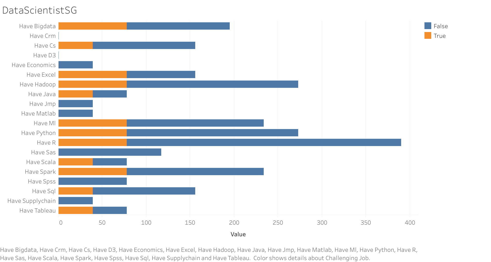

# Web Scrapping with R on Data Science Skills and applying Logistic Regression

## 1. Objective

Developing Logistig regression model on the technical skills required to predict the nature of the job. As Data Scientist job is itself challanging, learning a huge list of technology and frameworks, and even if mastering on some may not help on perfomace at the organization.
So before applying for a job, finding how much relevent the job is , becomes important, so this work is dedicated to build a model to predict the relevent job, based on key skills.


image credit: Swami Chandrasekaran

### 2. Singapore Job Market Analysis

In Singapore, the data scientist jobs are not too much dynamic, but surely requires some key skills to have. To get the relevent job information, we tried to do web scrapping on http://indeed.com.sg website to find out the details on the skill set required for data scientist job.

Following is an overview,


Now lets discuss about the implementation

## 3. Implementation

### 3.1 Web Scrapping - Gathering the relevent data

Load rvest library, rvest helps you scrape information from web pages. It is designed to work with magrittr to make it easy to express common web scraping tasks, inspired by libraries like beautiful soup.

```{r}
library(rvest)
```

Query first to read the job portal page.

```{r}

html_page <- read_html("https://www.indeed.com.sg/jobs?q=data+scientist&l=")
print("html loaded")
```
Lets find the number of number of search result for data scientist

```{r}
#total results

total_jobs <- html_page %>%
  html_node('#searchCount') %>%
  html_text()
total_jobs <- as.integer(unlist(strsplit(total_jobs," "))[6])
sprintf("total job are is %d" , total_jobs )
```

As the job portal is paginated, we need to navigate to each pages, 1 by 1 ,to get all the relevent jobs for data scientist.
*pages* , *companies* and *summaries* being extracted by navigating job portals paginated set.

```{r}
rev_concat <- function(x,y){
  return(paste(y,x,sep = ""))
}

no_of_pages = ceiling( total_jobs / 10 )
pages <- list()
companies <- list()
summaries <- list()
for( i in 1:no_of_pages){
  page_wise = read_html(paste("https://www.indeed.com.sg/jobs?q=data+scientist&start=",(10 * i-1)+1))
  company_name = page_wise %>%
      html_nodes('.result[itemtype="http://schema.org/JobPosting"] ') %>%
        html_node('.company') %>%
          html_text()
  companies <- c(companies, gsub("\n|[ \t]+", " ", company_name) )
  
  short_desc = page_wise %>%
      html_nodes('.result[itemtype="http://schema.org/JobPosting"] ') %>%
        html_node('.summary') %>%
          html_text()
  summaries <- c(summaries, gsub("\n|[ \t]+", " ", short_desc) )
  
  
  job.result <- page_wise %>%
      html_nodes('.result[itemtype="http://schema.org/JobPosting"] ') %>%
        html_attr(name="data-jk") %>%
          rev_concat("https://www.indeed.com.sg/rc/clk?jk=")
  pages <- c(pages,job.result)
}    

summaries[0]
```


Now, navigating to each link provided in the job portal page, to open the respective job description page to capture the entire job description.

```{r}
# Submit form and get new url
job_lists <- lapply(pages, function(item){
  description <- read_html(item) %>%
      html_text()
  return (tolower(gsub("[^A-Za-z\\-]|\\.+", " ",description)))
})

print("fetched all pages")
```

Converting the list of records to r data frames, for furthur analysis.

```{r}

df <- data.frame(unlist(companies),unlist(summaries))
names(df) <- c('company','requirement')
head(df)

is_skill_present <- function(skill, job_desc){
  return(if(grepl(skill, job_desc)==TRUE) 1 else 0)
}

add_skill_info <- function(skillName){
  #return(as.factor(unlist(lapply(job_lists, function(job_desc) is_skill_present(skillName,job_desc)))))
  return(unlist(lapply(job_lists, function(job_desc) is_skill_present(skillName,job_desc))))
}


```

Now adding Few technology skills, as column to dataset.

```{r}

df$have_python  <- add_skill_info('python')
df$have_r       <- add_skill_info(' r')
df$have_matlab  <- add_skill_info('matlab')
df$have_java        <- add_skill_info(' java')
df$have_scala        <- add_skill_info('scala')

df$have_sas <- add_skill_info(' sas')
df$have_spss <- add_skill_info('spss')
df$have_hadoop <- add_skill_info('hadoop')
df$have_jmp <- add_skill_info('jmp')
df$have_tableau <- add_skill_info('tableau')
df$have_sql <- add_skill_info(' sql')
df$have_spark <- add_skill_info('spark')
df$have_excel <- add_skill_info('excel')
df$have_d3 <- add_skill_info('d3.js')


df$have_ml <- add_skill_info('machine learning')
df$have_bigdata <- add_skill_info('big data')
df$have_cs <- add_skill_info('computer science')
df$have_economics <- add_skill_info('economics')
df$have_supplychain <- add_skill_info('supply chain')
df$have_crm <- add_skill_info('crm')

df$innovative <- add_skill_info('innovative')
df$teamplayer  <- add_skill_info('team player')
df$communicator  <- add_skill_info('communicator')
#to find challenging job
df$challenging_job <- as.factor((df$innovative=='1' & (df$teamplayer | df$communicator=='1'))) 

df <- df[-23]
df <- df[-23]
df <- df[-23]

head(df[3:23])

```

Saving the extracted dataset to csv for furthur analysis by different tools

```{r}
write.csv(df,file = "job_skills.csv")
```

### 3.2 Logistic Regression with r

#### 3.2.1 Importing Data
```{r}

jobs = read.csv('job_skills_v2.csv')

# Removing single-factor variables and descriptive text columns
jobs = jobs[, c(-1, -2, -4, -16, -22)]
```


#### 3.2.2 Testing for perfectly collinear variables and removing them
```{r}
cor(jobs, method = 'pearson')
```
```{r}
# Removing have_jmp, have_ml, have_supplychain variables
jobs = jobs[, c(-8, -13, -17)]
```


#### 3.2.3 Factorizing the variables
```{r}
# Factorizing the variables
for (i in 1:15){
  jobs[, i] = as.factor(jobs[, i])
}

summary(jobs)
```

#### 3.2.4 Train-Test Split
```{r}
library(caTools)
set.seed(123)
split = sample.split(jobs$challenging_job, SplitRatio = .8)
trainset = subset(jobs, split == TRUE)
testset = subset(jobs, split == FALSE)
```

#### 3.2.4 Logistic Regression
```{r}
jobsfit = glm(formula = challenging_job ~ ., 
              family = binomial,
              data = trainset)
summary(jobsfit)
```
Logistic regression algorithm did not converge, so we pick a smaller number of independent variables.

```{r}
jobsfit1 = glm(formula = challenging_job ~ have_java + have_tableau + have_scala, 
              family = binomial,
              data = trainset)
summary(jobsfit1)
```

#### 3.2.5 Chi-square Test
```{r}
attach(jobsfit1)
pchisq(null.deviance - deviance, df.null - df.residual, lower.tail = FALSE)
detach(jobsfit1)
```
Since p-value is less than 0.05, we reject the null hypothesis there is no relationship between the variables.

#### 3.2.6 Validating the model
```{r}
prob_pred = predict(jobsfit1, newdata = testset[-15], type = 'response')
challenge_pred = ifelse(prob_pred > 0.5, 1, 0)
```

#### 3.2.7 Confusion Matrix
```{r}
cm = table(testset[, 15], challenge_pred)
cm
```
Model has a 87% accuracy rate; 68 correct predictions out of 78.


** Thank you ** 
